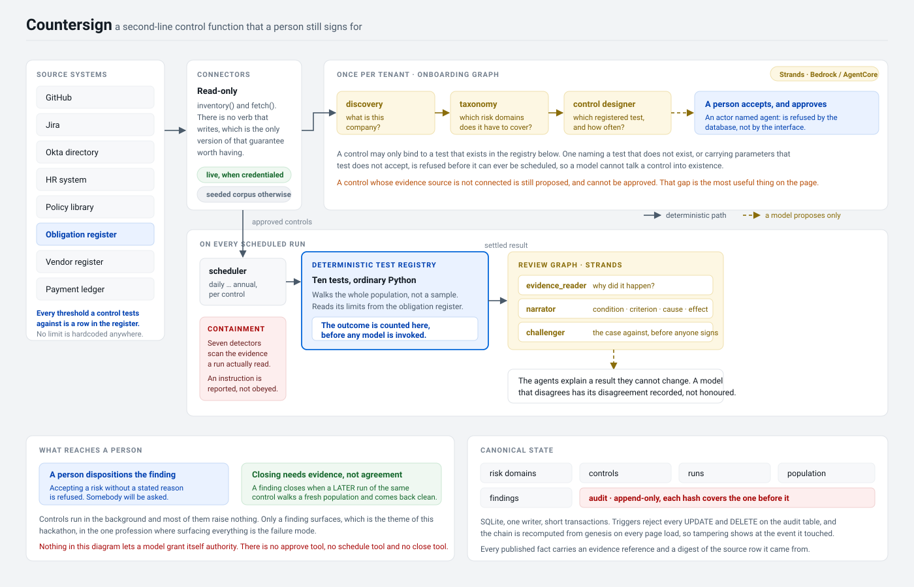

# Architecture

## Trust boundary

Countersign separates what a model may produce from what is true.

1. **Sources.** Eight read-only connectors. The interface has two verbs,
   `inventory()` and `fetch()`. There is no verb that writes. Every live adapter
   paginates to exhaustion, and raises rather than truncating, so "the whole
   population" is a property of the connector and not only of the test.
2. **Agent interpretation.** Six Strands agent roles, across a sequential
   onboarding workflow and one review graph. They propose an enterprise profile,
   a risk taxonomy, a control programme, and the prose of a control report.
3. **Deterministic decision.** Ten tests in `control_tests.py` walk the full
   population and count the outcome. This runs before any model is invoked on a
   control run, and its answer is never revised. A member the connectors could
   not serve evidence for goes to `not_tested`, and a run holding any of those
   is `inconclusive` rather than `effective`: untested is not passing.
4. **The findings surface.** Every exception of an ineffective run is
   represented by a finding before the run is stored; anything a review left
   uncovered is composed from the test result and marked `deterministic`. A
   challenge is an argument recorded beside a finding, so `survives: false`
   marks it rather than removing it, and a suggested downgrade is stored as a
   suggestion. What reaches a person is decided by the count.
5. **Authority.** Three transactions carry it: accepting a risk domain,
   approving a control into the schedule, and dispositioning a finding. All
   three refuse an actor whose identity begins with `agent:`, in the store
   rather than in the interface.
6. **Persistence.** SQLite, one writer, short `BEGIN IMMEDIATE` transactions,
   and an append-only audit table whose triggers reject `UPDATE` and `DELETE`.

## Loop A: onboarding

`connectors → discovery → taxonomy → control design → preflight → human gate`

The discovery agent inventories every source and infers the sector. The taxonomy
agent proposes risk domains, each carrying a `why_this_company` that the type
system requires to be specific, and a list of what was deliberately excluded.
The control design agent proposes controls, each bound to a test kind from the
registry it is shown.

Every proposed control is then executed once and discarded, to establish whether
it can run at all. A control whose evidence source is absent stays on the page
and is refused approval, with the reason recorded on the control.

## Loop B: a scheduled run

`scheduler → deterministic test → evidence reader → narrator → challenger → store`

The scheduler selects controls whose `next_due` has passed. The deterministic
test walks the population, applies the tolerance and settles the outcome. Only
then is the review graph entered, and it receives the settled result together
with the evidence behind it.

The narrator's `proposed_outcome` is recorded so that a disagreement between the
model and the count is visible. The count is what is stored.

The findings are reconciled the same way. Every exception of an ineffective run
has to be represented by one, and a challenge marks a finding rather than
withdrawing it, so the review decides how a finding is written and never whether
an exception reaches a person.

The injection scan runs in every model mode, over the documents that were part
of that run's evidence, before the graph is built. Containment is a property of
the ordering rather than of a model noticing.

## What closes a finding

A person can accept a risk, with a stated reason of at least a sentence, or
agree a remediation. `closed` is refused to every human actor.

`close_findings_with_evidence` closes a finding when a later run of the same
control produced no exceptions **and left nothing untested**. "Later" is ordered
by run id rather than by timestamp, because timestamps here have one-second
resolution and a finding raised and remediated inside the same second would
never close.

The coverage condition is the one that is easy to miss. A run that walked most
of its population, found nothing wrong with the part it walked, and closed the
finding about the part it did not, would be indistinguishable from a real
remediation afterwards. `effective` already implies complete coverage, and the
closing path re-reads the stored `not_tested` list anyway.

## Evidence

Every published fact carries an `EvidenceRef`: the source, a stable locator, a
label, and a SHA-256 digest of the row as the connector returned it. A run also
stores a digest over its whole population, so a report can be re-checked against
its sources months later and a corpus edit invalidates the evidence drawn from
it.

## Model modes

| Mode | What runs | Used for |
|---|---|---|
| `demo` | The deterministic composer in `narrative.py` | The seeded demonstration, tests, CI, and any evaluation without credentials |
| `bedrock` | The Strands agents against Amazon Bedrock | Live model output from the application process |
| `agentcore` | The Strands agents inside a deployed AgentCore runtime, invoked over `InvokeAgentRuntime`. The console builds no local model | Production, with the model layer on the other side of an IAM boundary |

The governance guarantees hold identically in all three, because they are
properties of the ordering and of the store rather than of the model.

## Deployment topology

The console container is the sole writer of the database and mounts `/app/data`
on durable storage. The AgentCore image is stateless, exposes `/ping` and
`/invocations`, and its runtime role grants model invocation and telemetry.

`countersign/agentcore_client.py` is the console side of that boundary. In
`agentcore` mode, `run_onboarding` and `run_review` leave the process: the
runtime is sent a control and a period, never a result, and it re-runs the
deterministic test on its own side. Two independent counts of the population
therefore exist for every review, and the console compares them. A disagreement
is recorded on the run and in the trace, and the console's count is published,
because the console owns the database.

An unreachable runtime degrades a review to the deterministic composer and
records it. The outcome was never the model's to produce, so the runtime is not
load-bearing for anything that gets published.

## Source boundary

A source kind falls back to the seeded corpus only while every source is a
fallback. As soon as one adapter is live, an uncredentialed kind resolves to
`DisconnectedConnector` and raises, so a control cannot join real evidence to
invented evidence and publish a single outcome over both. Three kinds have live
adapters today; the rest are corpus-only, which the console states per source.
`COUNTERSIGN_ALLOW_SOURCE_MIXING` lifts the boundary for a demonstration.

## Concurrency and integrity

- SQLite foreign keys, WAL, `synchronous=FULL`, and a five-second busy timeout
  on every connection.
- Writes take `BEGIN IMMEDIATE` and are short.
- A control is approved once: the transition is guarded on `status = 'proposed'`.
- A domain is decided once: the transition is guarded on `status = 'proposed'`.
- Each audit hash covers the previous hash, the timestamp, the actor, the event,
  the entity and the canonical payload. `countersign verify` recomputes the
  chain from genesis and names the event at which it breaks.
